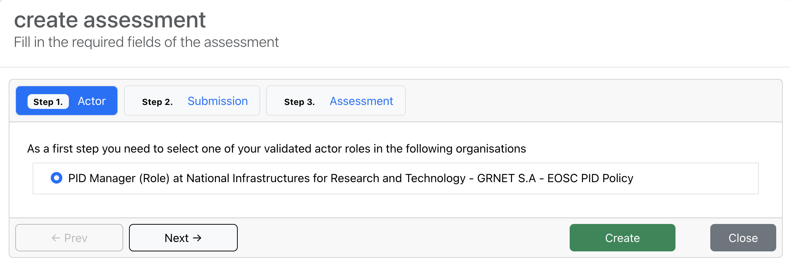
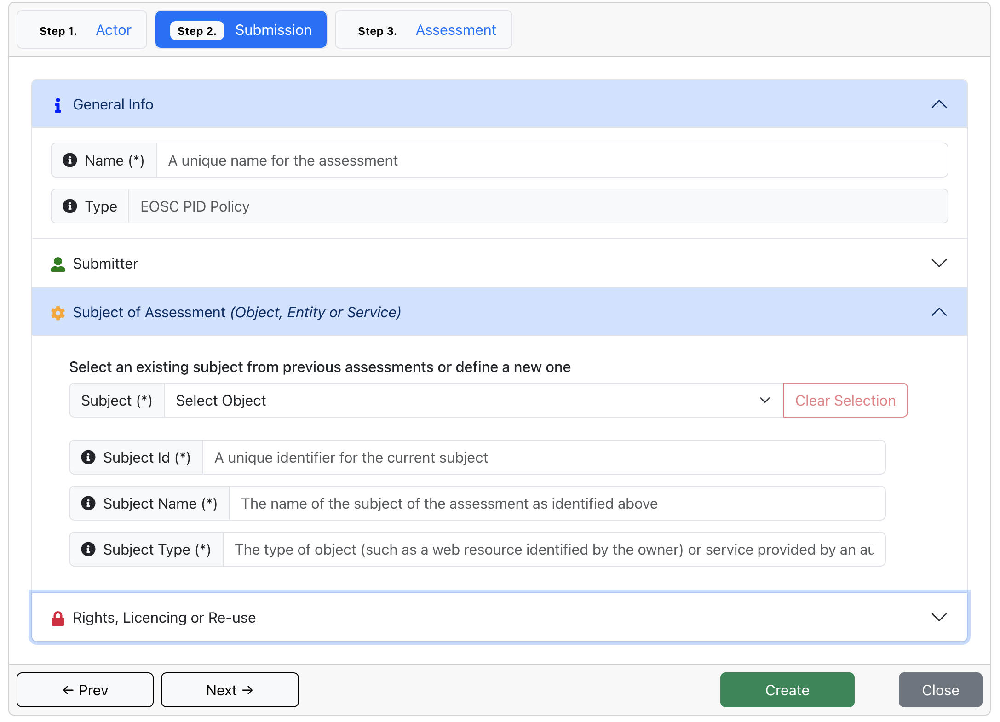
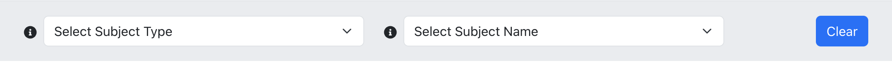

## Manage Assessments

To manage assessments, users should navigate to the **Assessments** tab from the **personalMenu** Menu located on the left sidebar.

### Creating a new Assessment

To begin, click the **Create New** button. **In the first step**, you will choose one of the validated actors and organizations that you are associated with. Once you’ve selected your preferable role and organization, click **Next**.

**In the second step**, a form will appear where you can fill in the necessary details for the assessment, including the name and subject. Once you've filled in these fields, click **Next**.

**In the final step**, the principles, criteria, and tests associated with them will be displayed. Once you have filled in the tests with the necessary information, you can click the **Create** button to create the assessment. Once created, the assessment will be added to your list of assessments, and you can proceed to manage it through editing, publishing, or sharing.

You can also navigate back and forth between steps by using the **Next** and **Prev** buttons. If you need to complete the assessment in stages, you can do a partial creation by clicking the **Create** button in any step to save your progress and return to it later.

### Importing an Assessment

The CAT Toolkit gives you the ability to import assessments as *.json format files that adhere to a specific schema.
By clicking the **Import** button, a form will be displayed where you can import the JSON file by choosing your preferred JSON file from your filesystem. Once the assessment is imported, you can follow the instructions described in the [Creating a new Assessment](#creating-a-new-assessment)
section to complete the process.

### Viewing Assessments

Upon entering the **Assessments** tab, users can view a comprehensive list of assessments created with their account. The following information is displayed for each assessment:

- **Name**: The name of the assessment.
- **Compliance**: Indicates whether the assessment meets compliance requirements.
- **Ranking**: The rank assigned to the assessment based on predefined tests.
- **Access**: Specifies who can view the assessment (e.g., public, private).
- **Subject**: The subject of the assessment.
- **Organisation**: The organisation associated with the assessment.
- **Created on:**: The date and time when the assessment was created.
- **Actions:**: Options available for each assessment (such as view details, edit, or delete).

Users can search for assessments by subject type and subject name, allowing for a more targeted search.

### Viewing Assessment Results

To view the assessment results, the user clicks on the **View Assessment Results** button . This action brings up a screen that displays detailed information about the assessment, including the overall score, performance metrics, and compliance details.
Additionally, there is an option available to download the results as a PDF file for further review.

### Editing an Assessment

To modify an assessment, the user clicks on the **Edit Assessment** button . This action enables them to update details such as the name, subject, or test results. After making the desired changes, the user can click **Submit** to update the assessment details immediately.

### Exporting & Downloading an Assessment

Users can export an assessment by clicking the **Export & Download Assessment** button . This action downloads the assessment in JSON format, exactly as it is stored in the database. This feature allows users to retrieve and analyze assessment data in its raw form for further processing or backup purposes.

### Publishing an Assessment

Users can publish an assessment to make it visible to others. To publish an assessment, click the **Publish Assessment** button . Only the creator or an administrator has the ability to publish an assessment. A confirmation dialog will open, prompting the user to confirm the action. To proceed, the user must click the **Publish** button.

### Sharing an Assessment

Users can share an assessment with other users by clicking the "Share Assessment" button . A dialog will open where the user can enter the email addresses of the users they wish to share the assessment with.
After entering the emails, the user must click the **Confirm** button to share the assessment with each email provided. Additionally, there is a section called **Already Shared With** that displays all the users the assessment has been shared with, along with their emails. This allows users to easily manage sharing settings and ensure the assessment is shared appropriately.

### Deleting an Assessment

To delete an assessment, the user clicks the **Delete Assessment** button . A dialog will open asking for confirmation. To permanently delete the assessment, the user must click the **Confirm Delete** button. This ensures that assessments are deleted only after explicit confirmation, preventing accidental deletions.

